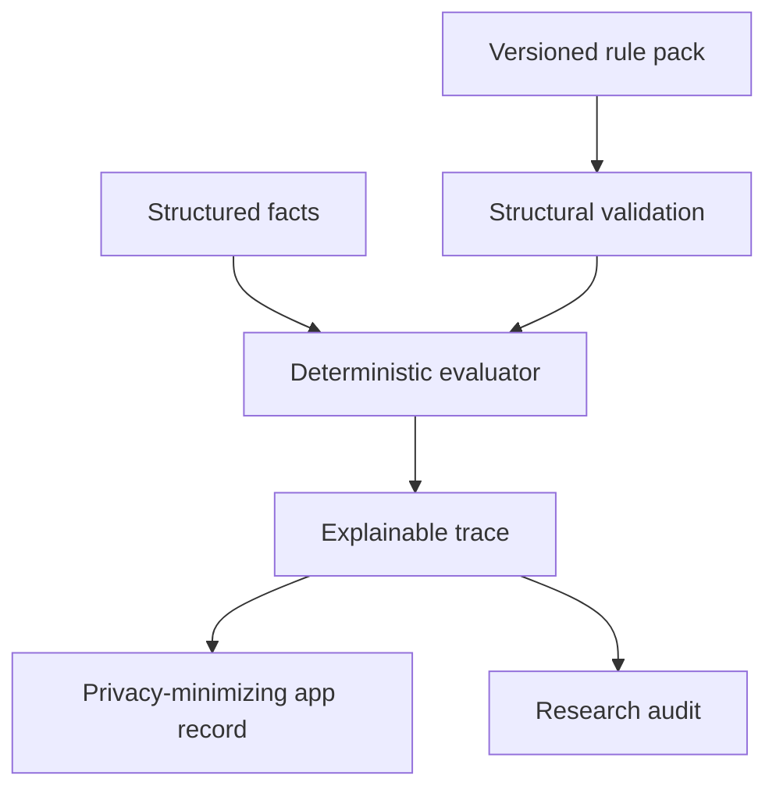

# PsychRuleKit

[](https://www.npmjs.com/package/psych-rulekit)
[](https://doi.org/10.5281/zenodo.22864323)

**A provenance-aware, deterministic rules engine for transparent mental-health research software.**

PsychRuleKit separates *how rules are evaluated* from *who authored the rules,
which source they came from, whether redistribution is permitted, and how they
were reviewed*. That boundary makes research software easier to audit, test,
extend, and cite.

> **Research use only.** A rule-set match is not a diagnosis. This repository
> does not distribute DSM-5/DSM-5-TR diagnostic criteria and is not affiliated
> with or endorsed by the American Psychiatric Association.

## Why this architecture exists

A flat object containing `min_symptoms_required` and
`duration_required_weeks` cannot safely represent nested groups, conditional
thresholds, developmental rules, multiple time windows, exclusions, or missing
information. PsychRuleKit uses a small expression tree and three-valued logic:

- `true`: the supplied facts satisfy the node;
- `false`: the supplied facts contradict the node;
- `unknown`: the available information cannot decide the node.

The final public dispositions are:

| Disposition | Meaning |
| --- | --- |
| `criteria_met` | Supplied facts match the supplied research rule set. |
| `criteria_not_met` | At least one required rule is not met. |
| `insufficient_information` | Missing facts could change the result. |
| `excluded` | An explicit exclusion rule matched. |

None means “diagnosed.”

## Architecture



The open engine is MIT-licensed. Clinical/manual-derived rule packs must be
governed and licensed separately.

## Included

- a dependency-free TypeScript evaluation engine;
- nested `all`, `any`, `count`, comparison, fact, and negation rules;
- explicit missing-information propagation;
- structural validation and explainable traces;
- an original CAS process-formulation graph for research/education;
- a React Native/Expo output adapter and SQLite migration;
- a JSON Schema for independently authored rule packs;
- a 40-condition *scope registry* with all unverified rules quarantined;
- tests for match, non-match, exclusion, missing data, validation, CAS, and app output.

## Not included

- copyrighted diagnostic criteria text;
- a DSM API or an official DSM implementation;
- clinical validation claims;
- diagnosis, treatment advice, or autonomous clinical decisions;
- network calls, analytics, accounts, or storage of raw narratives.

## Quick start

```bash
npm install psych-rulekit
```

```ts
import {
  evaluateRulePack,
  toAppEvaluationRecord,
  type AssessmentContext,
  type RulePack,
} from "psych-rulekit";

const rulePack: RulePack = /* your licensed, reviewed, versioned pack */;
const assessment: AssessmentContext = {
  facts: {
    trigger_present: true,
    duration_days: 10,
    impact_present: null, // unknown stays unknown
  },
};

const evaluation = evaluateRulePack(rulePack, assessment);
const appRecord = toAppEvaluationRecord(evaluation);
```

See [`examples/synthetic-stress-loop.ts`](examples/synthetic-stress-loop.ts)
for a runnable, deliberately non-diagnostic example.

## React Native / Expo

The core has no Node-only runtime dependency and performs no network access.
The app adapter emits a stable record that can be persisted with `expo-sqlite`.
See [`docs/APP_INTEGRATION.md`](docs/APP_INTEGRATION.md).

If this module is used in an app whose identity is explicitly non-diagnostic,
keep it behind a separate research feature boundary and preserve the visible
disclaimer in every result view.

## CAS formulation

`formulateCas()` maps user- or clinician-supplied observations into explicit
nodes and maintenance-loop edges:

`trigger → metacognitive beliefs → CAS strategies → consequences → belief reinforcement`

The output makes evidence and missing sections visible. It does not classify a
disorder or prescribe an intervention.

## Verification

```bash
npm ci
npm run verify
```

The same command runs in GitHub Actions.

## Rule-pack admission gate

A proposed pack must have:

1. authoritative source and exact edition/locator;
2. documented redistribution permission or an open license;
3. structural tests for `true`, `false`, and `unknown` paths;
4. independent clinical and methodological review;
5. intended use, locale, jurisdiction, version, and change history;
6. validation evidence appropriate to any claim made.

The 40-condition registry in `data/research-registry.json` is a roadmap, not a
clinical dataset. Its draft rules are intentionally absent.

## Publication model

- **GitHub**: canonical source, issues, review, CI, and releases.
- **npm**: installable artifact for TypeScript/React Native apps.
- **Zenodo**: archived releases and DOI for academic citation.

Detailed steps are in [`docs/PUBLISHING.md`](docs/PUBLISHING.md).

To start a new pack, copy [`templates/rule-pack.template.json`](templates/rule-pack.template.json)
and complete the accompanying review checklist before changing its status from `draft`.

## Contributing

Start with [`CONTRIBUTING.md`](CONTRIBUTING.md), the rule-pack proposal form,
and [`DISCLAIMER.md`](DISCLAIMER.md). Contributions that reproduce protected
criteria without documented permission will not be accepted.

## Citation

Khorami, I. (2026). *PsychRuleKit: A provenance-aware deterministic rules engine
for mental-health research* (Version v0.1.0) [Computer software]. Zenodo.
[https://doi.org/10.5281/zenodo.22864323](https://doi.org/10.5281/zenodo.22864323)

Machine-readable metadata is available in `CITATION.cff`.

## License

The software framework is licensed under the MIT License. This license does not
grant rights to third-party clinical manuals, instruments, trademarks, or data.
